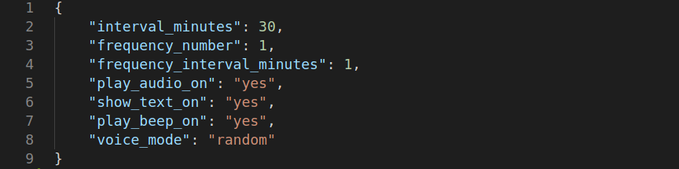

# catsleep
A lightweight tool that reminds user to take break after a certain time period.


## 1. Introduction

<p align= "justify">
  
__catsleep__ is a tool for people working long hours in computer specially, programmers, software engineers and other IT professionals. Sometimes, we are so much engaged in a task that we forget to take break or have a walk that would be very harmfull to our both mental and physical health. So, we initiated this tiny effort for making a tool that would remind the person/user after a certain time to take a break, a refreshment so that s/he can concentrate to their work with a fresh mind and it would help them to keep their mental and physical health sound.

</p>

--------------------------------------------------

## 2. Installation

### 2.1 Install in Linux

#### 2.1.1 Installation

* Install using the following command-

```bash
	git clone https://github.com/faruk-ahmad/catsleep
	cd catsleep
	bash install.sh
```

* Restart your computer to get it worked.

#### 2.1.2 Uninstallation

* Uninstall catsleep tool using the following command

```bash
	#clone the repo if you do not have the previously cloned repo

	git clone https://github.com/faruk-ahmad/catsleep
	cd catsleep
	bash uninstall.sh
```

* Provide "y" if you are prompt for approval to remove some config files.
* Restart your computer to finish the uninstallation process.

### 2.2 Install in MacOS

```bash
git clone https://github.com/faruk-ahmad/catsleep
cd catsleep
// you can run the main.py file to run the application
// installer not available yet
```

### 2.3 Install in Windows

```bash
git clone https://github.com/faruk-ahmad/catsleep
cd catsleep
// you can run the main.py file to run the application
// installer not available yet
```

--------------------------------------------------

## 3. Configuring your catsleep

The user configuration file resides in the user home directory. It is a hidden file and named as ".catsleep_config.json"
If you want to change any default behavior like, the interval in between alarms/notifications or want to switch the voice, then you need to edit this configuration file.

Open this file with any text editor and it looks like-



The parameters in the configuration are as follows

|   Parameter   |  Explanation   |  Possible Values | Effect | 
|:----------|-------------|------|-----------|
| interval | Interval in between alarms/notifications, integer value given as minutes  | 1 to infininte| change the interval in alarms/notification |
| frequency | Number of consecutive alarms/notifications in a slot  | 1 to infinite | Make multiple consecutive alarms at each alarm |
| frequency_interval | Gap in minutes in between consecutive alarms at a time  | 1 <= value < interval | make multiple alarms after this given time |
| play_audio | Trigger On/Off audio message as alarm  | "yes" for on, "no" for off | will turn on/off audio message in notification |
| show_text | Trigger On/Off text notification as alarm  | "yes" for on, "no" for off | will turn on/off text bubble  in notification |
| play_beep | Trigger On/Off beep sound as alarm | "yes" for on, "no" for off | will turn on/off beep sound in notification |
| voice | Switch in between male and female voice mode | "male", "female", "random" | will change the audio message mode |


* The notification or alarm works good with all the three [beep, audio & text] on. 

--------------------------------------------------

## 4. Getting Started

--------------------------------------------------

## 5. Features
--------------------------------------------------

#### 5.1 Features avaiable

* Notification to take break in works
* Customization in interval, alarm frequency
* Audio message, mode switching

#### 5.2 Features in Queue

* User can customize audio messages, text messages and beep sounds
* Multiple different interval in between alarms
* Extract task list from linked calender by user and set alarms base on tasks
* 

## 6. Report Issues

--------------------------------------------------
Before you report an issue in github, please make sure you are in the same pace with the up to date commit in our github repo. 


## 7. How to Contribute

--------------------------------------------------

You can contribute in the one or either way of the following-

#### 7.1 Bug Reporting
	-- You can report a bug by adding issue in github
	-- Or you can contribute by sharing how you solved and issue

#### 7.2 Requesting a Feature
	-- If you came accross any new idea that can be added as feature

#### 7.3 Adding Feature, Pull Request
	-- If you come with new idea of a feature and add it
	-- Send us pull request

#### 7.4 Adding Nofification Resource
	-- Adding some new cool audio file for notification
	-- Adding some amazing text message for notification
	-- Adding some amazing beep sound for notification
